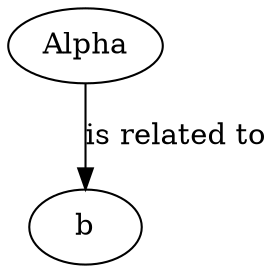
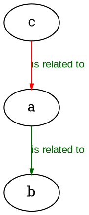
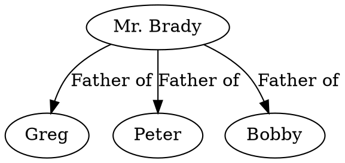
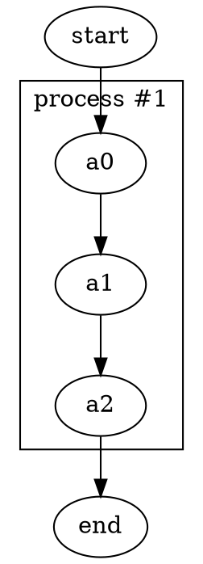
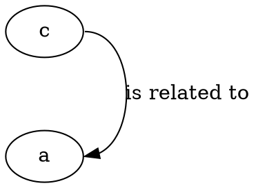

The `data` worksheet is where you define the content of every graph. Each row describes either a relationship between two items (an edge) or a standalone item definition (a node). By filling in the right columns, you control what gets drawn, how it looks, and how it is labeled — all without writing DOT code yourself.

## How rows become nodes and edges

The two most important columns are **Item** and **Related Item**:

- A row with a value in **Item** and a value in **Related Item** produces an **edge** from the item to the related item.
- A row with a value in **Item** but no value in **Related Item** produces a **node** definition, letting you set a label or style for that node.

In the example above, the first row defines an edge from `a` to `b` with an edge label, and the second row defines node `a` with the display label `Alpha`.

## Column reference

The `data` worksheet contains eleven columns (A–K). The table below describes each one.

| Column | Name            | Required | Description                                                                                          |
|--------|-----------------|----------|------------------------------------------------------------------------------------------------------|
| A      | `Indicator`     | —        | Special flags: `#` marks the row as a comment (shown in green, excluded from the graph); `!` appears automatically when an error is detected on that row (row turns red). |
| B      | `Item`          | Yes      | The unique identifier for a node, or the **from** node in an edge relationship.                      |
| C      | `Tail Label`    | No       | Text placed near the tail (origin) end of an edge. Hidden by default.                                |
| D      | `Label`         | No       | Text label for a node (displayed inside the shape), an edge (displayed along the spline), or a cluster title. |
| E      | `External Label`| No       | Text placed outside the node shape or away from the edge spline (uses the `xlabel` attribute). Hidden by default. |
| F      | `Head Label`    | No       | Text placed near the head (destination) end of an edge. Hidden by default.                           |
| G      | `Tooltip`       | No       | Hover tooltip text for nodes, edges, or clusters. Only applies to SVG output. Hidden by default.     |
| H      | `Related Item`  | For edges | The unique identifier of the **to** node in an edge relationship. Leave blank to define a node.     |
| I      | `Style Name`    | No       | The name of a style defined in the `styles` worksheet. Selecting a style applies its format string to the node or edge. |
| J      | `Attributes`    | No       | Extra Graphviz attributes that apply only to this single row, overriding or supplementing the style. |
| K      | `Messages`      | —        | Populated automatically when the graphing macros detect a data error on the row. Hidden by default; shown when an error is found. |

<Note>
Columns `Tail Label` (C), `External Label` (E), `Head Label` (F), `Tooltip` (G), and `Messages` (K) are hidden by default because they are used less frequently. You can toggle their visibility from the **Show Columns** button in the **'data' Worksheet** group on the right side of the Ribbon.
</Note>

## Node labels and defaults

If you leave both **Label** and **External Label** empty for a node, the Relationship Visualizer uses the **Item** value as the node's displayed label. To override this — for example, to show `Alpha` instead of `a` — add a row with `a` in **Item** and `Alpha` in **Label**, leaving **Related Item** blank.

## Applying styles and attributes

The **Style Name** column links a row to a named style from the `styles` worksheet. When you click on a cell in the **Style Name** column, a dropdown list appears showing all available styles.

The **Attributes** column lets you add one-off Graphviz attributes that apply only to that row. This is useful for highlighting a specific node or relationship without creating a whole new style.

In the second edge above, `color="red"` in the **Attributes** column overrides the green color from the applied style, while all other style attributes remain in effect.

## Comma-separated items

You can enter a comma-separated list in the **Item** or **Related Item** column to create multiple edges from a single row. The Relationship Visualizer expands the list and generates one edge per item.

For example, entering `Greg, Peter, Bobby` in **Related Item** with `Mr. Brady` in **Item** and `Father of` in **Label** produces:

A comma-separated list can appear in **Item**, **Related Item**, or both columns simultaneously.

## Specifying clusters

To group nodes into a cluster, place an opening brace `{` in the **Item** column (with an optional cluster title in **Label**) on the row above the items to group, and a closing brace `}` in **Item** on the row below the last item in the group.

Clusters can be nested by adding additional pairs of braces. Make sure every `{` has a matching `}` — Graphviz will not render the graph if they are unbalanced.

## Specifying ports

To control where an edge attaches to a node, append a colon and a compass point to the item name in the **Item** or **Related Item** column. For example, `c:e` routes the edge to the east side of node `c`, and `a:e` attaches the other end to the east side of node `a`.

