The `styles` worksheet is where you define the visual appearance of your graph elements. It works similarly to a CSS stylesheet: you give each style a name and specify a set of Graphviz attributes that control its shape, color, font, and other properties. Once defined, a style can be applied to any number of nodes, edges, or clusters in the `data` worksheet by selecting its name from a dropdown list.

## The styles worksheet

You open the `styles` worksheet from the **Style** section of the **Launchpad** ribbon tab. The worksheet contains one row per style definition. Each row has the following columns:

| Column | Name             | Description                                                                                                         |
|--------|------------------|---------------------------------------------------------------------------------------------------------------------|
| A      | `Indicator`      | Place a `#` to comment out a style, excluding it from all graph renderings.                                        |
| B      | `Style`          | The name of the style. This name appears in the **Style Name** dropdown on the `data` worksheet.                   |
| C      | `Format`         | The Graphviz attribute string that defines the style's visual appearance.                                          |
| D      | `Style Type`     | How the style is applied. Must be one of: `node`, `edge`, `subgraph-open`, `subgraph-close`, `keyword`, or `native`. |
| E+     | View switches    | One column per view. Each cell contains `Yes` or `No` to control whether this style is active in that view.        |
| Last+2 | Preview image    | An optional preview image generated from the style's format string.                                                |

## Style format strings

The **Format** column contains a space-separated list of Graphviz attributes. These are the same attributes you would write inside brackets in a DOT file. For example, the `Medium Square` node style uses:

```
shape=square height=0.5 width=0.5 fixedsize=True style=filled penwidth=1 fontname=Arial fontsize=8
```

When this style is applied to a node in the `data` worksheet, the Relationship Visualizer injects those attributes directly into the generated DOT code:

```dot
digraph "Relationship Visualizer"
{
    a [ shape=square height=0.5 width=0.5 fixedsize=True style=filled penwidth=1 fontname=Arial fontsize=8 label="Alpha" ];
}
```



An edge style works the same way. The `Flow - Positive` style, for example, uses:

```
fontname=Arial fontsize=10 color=darkgreen fontcolor=darkgreen arrowsize=0.5
```

## Style types

The **Style Type** value tells the Relationship Visualizer how to interpret each row when generating DOT output.

| Style type        | Use case                                                                    |
|-------------------|-----------------------------------------------------------------------------|
| `node`            | Applies attributes to a node declaration.                                   |
| `edge`            | Applies attributes to an edge declaration.                                  |
| `subgraph-open`   | Emits the opening of a cluster subgraph (used with the `{` brace row).     |
| `subgraph-close`  | Emits the closing of a cluster subgraph (used with the `}` brace row).     |
| `keyword`         | Emits a raw Graphviz keyword statement.                                     |
| `native`          | Emits a raw DOT language string verbatim.                                   |

## Applying styles in the data worksheet

When you click on a cell in the **Style Name** column (column I) of the `data` worksheet, a dropdown list appears showing every style defined in the `styles` worksheet. Select a style name to apply its format string to that row. The **Style Name** column also works with the **View** system — a style is only applied if it is enabled (`Yes`) in the currently selected view column.

## Style previews

Each style row in the `styles` worksheet can display a small preview image showing what the style looks like when rendered. You manage previews from the **Previews** group on the **Styles** ribbon tab:

- **Refresh** — regenerates the preview for the currently selected style row.
- **Refresh All** — deletes all previews and regenerates a complete new set for every style.
- **Clear All** — removes all preview images from the worksheet.

## Cluster style naming

When you define a cluster style, the Relationship Visualizer creates two rows: one for the cluster opening (`subgraph-open`) and one for the closing (`subgraph-close`). The **Style Naming** group on the **Styles** ribbon tab lets you configure the suffix appended to the style name to identify each row. The defaults are **" Begin"** and **" End"**, but you can change them to alternatives such as **" Open"** / **" Close"** or **" Start"** / **" Stop"**.

## Creating and editing styles

Use the **Style Designer** worksheet to build styles visually — pick shapes, colors, gradients, fonts, border styles, and arrowheads — and then save them as named entries in the `styles` worksheet. You can open the Style Designer for any existing style by selecting its **Format** cell and clicking the **Edit** button in the **Format** group on the **Styles** ribbon tab, or by clicking the pencil icon that appears on the right side of the selected cell.

<Tip>
See [Style Designer](/guides/style-designer) for a full walkthrough of creating and customizing styles.
</Tip>
