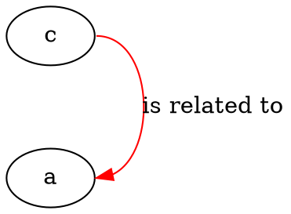
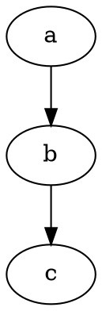

Once you are comfortable with the core workflow, the Relationship Visualizer exposes a range of advanced Graphviz capabilities. This page covers HTML-like labels that render tables inside nodes, strict graphs that eliminate duplicate edges, compass-point edge ports, `newrank` for aligning nodes across clusters, default attribute keywords, and the built-in HELP reference worksheets.

## HTML-like labels

Graphviz supports a special label syntax where the value is enclosed in `<` and `>` delimiters instead of quotes. Inside those delimiters you can use an HTML-like grammar to produce formatted text — bold, italic, underline, strikethrough — or even a full table structure. Enter these values directly in the `Label` column of the `data` worksheet.

<Note>
Graphviz HTML-like labels are not actual HTML. The grammar is a subset that Graphviz recognizes and renders. Unsupported HTML constructs are ignored or cause rendering errors.
</Note>

### Inline text formatting

A label with mixed formatting:

```
<This label has <b>Bold</b>, <i>italic</i>, <u>underlined</u>, and <s>strikeout</s> text>
```

Place this value in the `Label` column of an edge row to see formatted text on the edge.

### Table labels

HTML-like labels can describe full tables, giving nodes a structured, multi-cell appearance:

```
<
<table>
  <tr>
    <td>Cell 1</td>
    <td>Cell 2</td>
  </tr>
</table>
>
```

Enter this in the `Label` column of a node row (a row with an `Item` value but no `Related Item`). Graphviz renders the node as a table shape.

HTML-like labels work for nodes, edges, and clusters. You can combine them freely within the same diagram.

The full HTML-like label grammar is documented at [graphviz.org](https://www.graphviz.org/doc/info/shapes.html#html).

## Strict graphs

When your data naturally produces multiple edges between the same pair of nodes — for example, when plotting bidirectional relationships — the graph can become cluttered with duplicate lines. Setting the graph to **strict** mode instructs Graphviz to merge all edges between the same pair of nodes into a single edge.

To enable strict mode, open the **Graphviz** ribbon tab, locate the **Edge Options** section, and set **Apply "strict" rules** to **Yes**. Press **Refresh Graph** to apply.

<Tip>
Strict mode is useful for undirected relationship data such as geographic borders, where each pair of neighbors appears twice (Michigan–Ohio and Ohio–Michigan become one edge).
</Tip>

## Specifying edge ports

By default, Graphviz decides where on a node's boundary an edge begins and ends. You can override this by appending a colon and a compass point to the node name in the `Item` or `Related Item` column.

Compass points are: `n`, `ne`, `e`, `se`, `s`, `sw`, `w`, `nw`, `c` (center).

For example, to route the edge from the east side of node `c` to the east side of node `a`, enter `c:e` in the `Item` column and `a:e` in the `Related Item` column:



Ports let you control the visual flow of edges in dense diagrams and prevent crossings that the automatic layout would otherwise produce.

## Edge weight for straighter lines

The `weight` attribute tells the layout engine how much to favor keeping a particular edge straight and short. Higher values act like a stronger spring, pulling connected nodes closer together and producing more direct routing.

Add `weight=10` in the `Attributes` column of an edge row to straighten that edge:



Increasing `weight` is the simplest way to tidy up long, curved edges in a `dot` layout.

## newrank for aligning nodes across clusters

The `dot` engine normally restricts `rank="same"` alignment to nodes within the same cluster. The `newrank` attribute — introduced in Graphviz 2.30 — enables an alternative ranking algorithm that allows same-rank alignment across different clusters.

To activate `newrank`, add a native Graphviz directive row to the `data` worksheet:

1. Place `>` in the `Item` column to mark the row as a native command.
2. Enter `newrank="true"` in the `Label` column.

Alternatively, select the **New Rank** option in the **Graph Options** section of the **Graphviz** ribbon tab.

After enabling `newrank`, add another native command row containing:

```
{ rank="same"; "router1"; "router2"; }
```

This forces `router1` and `router2` to sit on the same horizontal rank, even if they belong to different clusters.

## Default attributes with graph, node, and edge keywords

Graphviz supports cascading default attributes: placing a `node`, `edge`, or `graph` statement in the DOT source sets a default that all subsequently defined elements of that type inherit, until the default is overridden or reset.

The Relationship Visualizer exposes this mechanism through the `Item` column. When a row contains the keyword `node`, `edge`, or `graph` in the `Item` column, the tool emits a default-attribute statement using the values in the `Style Name` and `Attributes` columns.

Rows that use these keywords are visually distinguished in the worksheet with a highlighted background and bold-italic text so they are easy to spot.

**Example:** Adding a `node` keyword row with `fontcolor="red"` in the `Attributes` column makes every node defined after that row use red font, until a second `node` keyword row resets the color.

<Info>
Objects defined *before* a default-attribute keyword row do not inherit the default retroactively. Only objects created after the keyword row are affected.
</Info>

## Adding native Graphviz directives

Place `>` in the `Item` column to insert any raw DOT statement directly into the generated source. Use the `Label` column for the content of the statement.

This technique is how you inject statements that the Relationship Visualizer does not expose through ribbon controls, such as:

- `compound="true"` — enables edges that connect to cluster boundaries.
- `{ rank="same"; "node1"; "node2"; }` — aligns nodes on the same rank.
- `ordering="out"` — forces outgoing edges to appear left-to-right in definition order.
- `rotate=90` — renders the graph in landscape orientation.

## Edges to and from cluster boundaries

To draw an edge that starts or ends on a cluster boundary rather than a specific node inside it:

1. Enable the `compound` attribute by adding a native directive row with `compound="true"`.
2. Give each cluster an explicit name (for example, `cluster0`) by placing the name before the `{` in the `Item` column.
3. For the edge that should connect to a cluster boundary, add `lhead="cluster1"` in the `Attributes` column to attach the arrowhead to the cluster boundary, or `ltail="cluster0"` to route the tail from the cluster boundary.

The `Item` and `Related Item` columns must still reference actual nodes that exist inside the respective clusters — the `lhead` and `ltail` attributes redirect only the visual endpoint of the drawn edge.

## HELP worksheets

The workbook includes built-in reference worksheets that you can show or hide from the **Launchpad** ribbon tab:

<AccordionGroup>
  <Accordion title="HELP – attributes">
    Lists every Graphviz attribute with its valid values, default, and which element types it applies to (graph, node, edge, cluster). Use it as a quick reference when writing values in the `Attributes` column.
  </Accordion>

  <Accordion title="HELP – colors">
    Shows all 267 Graphviz color schemes with their color swatches and names. Each scheme lists between 3 and 656 colors. Use it to look up exact color names for the `color`, `fillcolor`, and `fontcolor` attributes, or to explore Brewer palette options.
  </Accordion>

  <Accordion title="HELP – shapes">
    Displays a visual gallery of every Graphviz node shape. Use it to browse shape options before opening the Style Designer, or to look up the exact attribute value name (for example, `shape=Msquare`).
  </Accordion>
</AccordionGroup>

## record and Mrecord shapes

The `record` shape renders a node as a series of labeled boxes arranged horizontally or vertically. Nest fields in braces `{ ... }` to flip orientation. The `Mrecord` shape is identical but uses rounded corners on the outer border.

- `A | B | C | D` — four fields left to right
- `{A | B | C | D}` — four fields top to bottom
- `A | { B | C } | D` — B above C, with A left and D right

You can assign port names to individual fields by prefixing the field text with `<portname>`. This lets you attach edges to specific cells within the record using the `node:port` notation.

The field orientation of a record also responds to `rankdir`: in top-to-bottom layouts the top-level fields are horizontal; in left-to-right layouts they are vertical.
