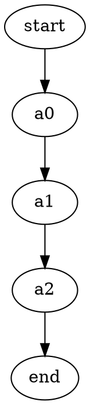
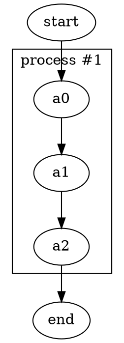
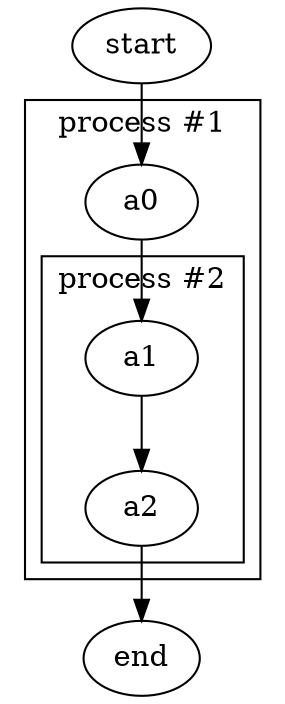
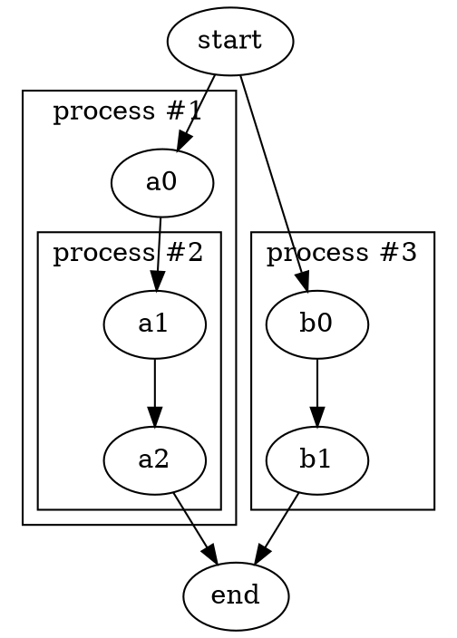

Clusters let you draw a labeled box around a group of related nodes and edges. In Graphviz, clusters are a special type of subgraph whose name begins with `cluster`. When supported by the layout engine, nodes belonging to the same cluster are drawn together inside a rectangle. In the Relationship Visualizer, you define clusters entirely within the `data` worksheet by adding special brace rows — no DOT syntax knowledge required.

## How brace rows work

To create a cluster, you add two marker rows to the `data` worksheet:

1. A row with `{` in the `Item` column — this opens the cluster. Add a title for the cluster in the `Label` column of this same row.
2. A row with `}` in the `Item` column — this closes the cluster. All data rows between the opening and closing brace belong to that cluster.

Every row between the `{` and `}` markers — whether it defines an edge or a node — is placed inside the cluster boundary.

<Warning>
You must have exactly one closing `}` for every opening `{`. A mismatch in the number of open and close braces prevents Graphviz from rendering the graph at all.
</Warning>

## Creating a basic cluster

Start with a flat graph (no clusters):

| Item  | Related Item |
|-------|--------------|
| start | a0           |
| a0    | a1           |
| a1    | a2           |
| a2    | end          |

To wrap `a0`, `a1`, and `a2` inside a cluster labeled "process #1", insert an opening brace row before `a0` and a closing brace row after `a1 → a2`:

| Item | Related Item | Label      |
|------|--------------|------------|
| start | a0          |            |
| \{    |              | process #1 |
| a0   | a1           |            |
| a1   | a2           |            |
| \}    |              |            |
| a2   | end          |            |

Press **Refresh Graph**. The DOT output becomes:

## Nested clusters

Graphviz supports clusters within clusters. Add another pair of brace rows inside an existing cluster to create a nested subgraph.

Extending the previous example, add a second cluster labeled "process #2" around the `a1 → a2` edge:

| Item | Related Item | Label      |
|------|--------------|------------|
| start | a0          |            |
| \{    |              | process #1 |
| a0   | a1           |            |
| \{    |              | process #2 |
| a1   | a2           |            |
| \}    |              |            |
| \}    |              |            |
| a2   | end          |            |

You can nest clusters as deeply as needed. There is no hard limit on the number of clusters or their nesting depth.

## Multiple sibling clusters

Clusters do not have to be nested — you can define several clusters at the same level. Adding rows for a third cluster alongside the first two:

## Named clusters

By default, the Relationship Visualizer auto-generates cluster names (`cluster_1`, `cluster_2`, etc.) based on the order clusters appear in the worksheet. If you need to reference a cluster by name — for example, to draw an edge to the cluster boundary — place an explicit name before the `{` character in the `Item` column.

For example, entering `cluster0{` in the `Item` column opens a cluster named `cluster0`. Names that begin with `cluster` are treated by Graphviz as cluster subgraphs; names that do not begin with `cluster` are treated as plain subgraphs without a visible boundary.

<Info>
Use explicit cluster names whenever you intend to connect edges to a cluster boundary using `lhead` or `ltail` attributes. Auto-generated names can change if rows are reordered, making the connection unreliable.
</Info>

## Applying styles to clusters

To apply a style to a cluster, enter a style name in the `Style Name` column of the opening `{` row. Create cluster styles using the **Style Designer** worksheet with **Cluster** selected as the element type. Cluster styles can control fill color, border color, pen width, font, and label placement.

## Checking brace balance

When a brace mismatch occurs, Graphviz fails silently — the graph simply does not render. If your diagram disappears or stops updating:

1. Count the `{` rows in the `Item` column.
2. Count the `}` rows in the `Item` column.
3. The two counts must be equal.

Use the **Delete all data** button only as a last resort — it clears the entire worksheet.

## Cluster layout

Clusters are best supported by the `dot` layout engine. Other engines (such as `neato` or `fdp`) may not render cluster boundaries visually, even if the DOT source is valid. If cluster boundaries are not appearing, switch the **Layout** selector on the **Graphviz** ribbon tab to `dot`.
