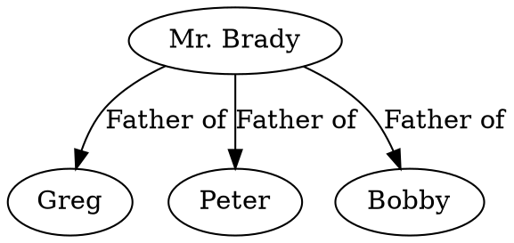

The **Relationship Visualizer** turns spreadsheet rows into Graphviz diagrams. You define nodes and edges by filling in the `data` worksheet, choose a layout engine and graph direction from the **Graphviz** ribbon tab, and the tool generates a DOT source file and renders the graph beside your data. This page walks you through the full workflow from opening a workbook to seeing your first graph.

## The Graphviz ribbon tab

Every graph-building action lives in the **Graphviz** ribbon tab. Activate it by clicking its name in the Excel ribbon. Key controls include:

- **Automatic** — when toggled on, the graph re-renders each time you leave a cell. Toggle it off when you want to make several edits before refreshing.
- **Refresh Graph** — manually triggers a render. Use this whenever **Automatic** is off or you want to force a redraw.
- **Layout engine** — selects the Graphviz layout algorithm (`dot`, `neato`, `fdp`, `sfdp`, `twopi`, `circo`, `osage`, `patchwork`).
- **Graph direction (rankdir)** — controls the flow of a `dot` layout: **TB** (top to bottom), **BT** (bottom to top), **LR** (left to right), or **RL** (right to left).
- **Splines** — controls how edges are routed: `spline`, `line`, `polyline`, `curved`, `ortho`, or `none`.
- **Delete all data** — clears the `data` worksheet and resets it to blank form.

<Tip>
Hover over any ribbon control to see a tooltip describing what it does.
</Tip>

## Core workflow

<Steps>
  <Step title="Open the Relationship Visualizer workbook">
    Open `Relationship Visualizer.xlsm`. The workbook includes all the worksheets, formulas, and macros needed to generate graphs. Enable macros when prompted.
  </Step>

  <Step title="Activate the Graphviz ribbon tab">
    Click the **Graphviz** tab in the Excel ribbon to bring its controls into view.
  </Step>

  <Step title="Enable Automatic rendering">
    Click the **Automatic** toggle so that the graph updates as you type. The button appears pressed when active.
  </Step>

  <Step title="Navigate to the data worksheet">
    Click the `data` worksheet tab at the bottom of the workbook. This is where every node and edge relationship is defined.
  </Step>

  <Step title="Enter your first relationship">
    In row 3, type `a` in the `Item` column and `b` in the `Related Item` column. As soon as you leave the cell, the graph renders beside your data.

    The generated DOT source looks like this:

    ```dot
    digraph "Relationship Visualizer"
    {
        a -> b;
    }
    ```
  </Step>

  <Step title="Expand the graph">
    Add more rows to build out your relationships. Each row becomes one edge (or node definition) in the diagram. After entering the data below, your graph has three nodes connected in a cycle:

    | Item | Related Item |
    |------|--------------|
    | a    | b            |
    | b    | c            |
    | c    | a            |

    ```dot
    digraph "Relationship Visualizer"
    {
        a -> b;
        b -> c;
        c -> a;
    }
    ```
  </Step>

  <Step title="Add edge labels">
    Fill in the `Label` column to describe each relationship. Press **Refresh Graph** to update the diagram.

    ```dot
    digraph "Relationship Visualizer"
    {
        a -> b[ label="is related to" ];
        b -> c[ label="is related to" ];
        c -> a[ label="is related to" ];
    }
    ```
  </Step>

  <Step title="Add node labels">
    To rename a node without changing every edge that references it, add rows that contain only an `Item` value and a `Label` value (leave `Related Item` blank). The tool treats rows with no `Related Item` as node definitions.

    ```dot
    digraph "Relationship Visualizer"
    {
        a -> b[ label="is related to" ];
        b -> c[ label="is related to" ];
        c -> a[ label="is related to" ];
        a [ label="Alpha" ];
        b [ label="Bravo" ];
        c [ label="Charlie" ];
    }
    ```
  </Step>

  <Step title="Choose a layout engine and direction">
    On the **Graphviz** ribbon tab, select a **Layout** (for example, `dot` for hierarchical diagrams) and a **Graph direction** (for example, **LR** to flow left to right). Press **Refresh Graph** to apply.
  </Step>
</Steps>

## Comma-separated items

You can list multiple node names in the `Item` or `Related Item` column, separated by commas. The tool expands each comma-separated entry into individual edges, reducing repetitive data entry.

For example, placing `Greg, Peter, Bobby` in the `Related Item` column on a single row generates three separate edges:



The same expansion works in the `Item` column. You can also use comma-separated lists in both columns simultaneously to create a full cross-product of relationships.

## The Attributes column

Use the `Attributes` column to pass any raw Graphviz attribute directly to a node or edge, overriding or supplementing values from the `Style Name` column. For example, entering `color="red"` in the `Attributes` column of an edge row changes just that edge's color while leaving the rest of the style intact.

## Layout engines

| Engine      | Best for                                              |
|-------------|-------------------------------------------------------|
| `dot`       | Hierarchical graphs with clear top-to-bottom flow     |
| `neato`     | Undirected graphs using spring-model layout           |
| `fdp`       | Larger undirected graphs, force-directed placement    |
| `sfdp`      | Very large undirected graphs with multiscale layout   |
| `twopi`     | Radial layouts centered on a root node               |
| `circo`     | Circular layouts for cyclic structures                |
| `osage`     | Array/cluster layouts — Kanban boards, grids         |
| `patchwork` | Squarified treemaps — proportional area comparisons  |

<Note>
The **Graph direction** (rankdir) setting only affects the `dot` layout engine. Other engines use their own placement algorithms and ignore this setting.
</Note>

## Next steps

<CardGroup cols={2}>
  <Card title="Design graph styles" icon="palette" href="/guides/style-designer">
    Use the Style Designer to create reusable node and edge styles.
  </Card>
  <Card title="Group nodes into clusters" icon="object-group" href="/guides/clusters">
    Wrap related nodes in labeled subgraph boundaries.
  </Card>
  <Card title="Advanced techniques" icon="wand-magic-sparkles" href="/guides/advanced-graphviz">
    HTML-like labels, strict graphs, edge ports, and more.
  </Card>
  <Card title="Core concepts" icon="book-open" href="/concepts/data-worksheet">
    Understand every column in the data worksheet.
  </Card>
</CardGroup>
